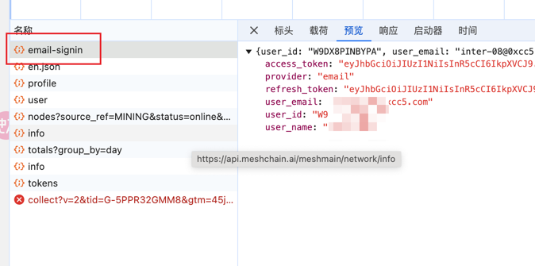

# meshchain-tool
基于大佬的`python`脚本一直被`403`于是用`go`写了一套

# 原作者仓库地址: https://github.com/GzGod/Meshchain

**如果觉得本文有用的话帮我点个🌟Star吧。非常感谢!**

**有问题可以联系我的tg: https://t.me/Josh_Passion**


---

## 🚀 功能

- ✅ 自动创建 `node` `unique id`
- 🌾 自动刷新 `access_token` | `refresh_token`
- 💰 自动 `claim` 积分
---

## 💻 环境及需要的账户

- 安装 Golang 环境 (目前我用的Go版本是 `go 1.23.2`)
- 已经注册好的账号的 `access_token`,`refresh_token`,`unique_id` (因为目前网站加了`captcha` 只能手动注册获取)
  - `access_token`,`refresh_token` 在登录的请求 `email-signin` 的 `response` 里可以获取
  - `unique id` 可以通过我里面脚本来创建。或者你手动通过插件来创建复制到 `config.toml` 中


---

## 🛠️ 设置

1. 克隆仓库：
   ```bash
   git clone https://github.com/miaomk/meshchain-tool
   cd meshchain-tool
   ```
2. 安装Golang 环境：
   ```bash
    这个我就不多说了 网上都有教程
   ```

---

## ⚙️ 配置

### config.toml

该文件包含脚本的常规设置：

```toml
# 账号设置 多个账号就 多个[[account]]即可
[[accounts]]
access_token = '' # 账号的 access_token。从 dashboard 上获取
email = 'email1' # 用来记录脚本处理了哪些邮箱。
refresh_token = '' # 账号的 refresh_token。从 dashboard 上获取
unique_ids = [''] # node 的 qunique id。从 dashboard 上获取。如果不想安装插件获取就使用 `unique_ids = "" ` 当前脚本会自动生成一个
update_timestamp = '' # 用来记录 config.toml 修改时间。

[[accounts]]
access_token = '' # 账号的 access_token。从 dashboard 上获取
email = 'email2' # 用来记录脚本处理了哪些邮箱。
refresh_token = '' # 账号的 refresh_token。从 dashboard 上获取
unique_ids = [''] # node 的 qunique id。从 dashboard 上获取。如果不想安装插件获取就使用 `unique_ids = "" ` 当前脚本会自动生成一个
update_timestamp = '' # 用来记录 config.toml 修改时间。

#[[accounts]]...

# 全局设置
[global]
base_url = 'https://api.meshchain.ai/meshmain' # 项目方请求地址。写死
request_interval = 60 # 每次循环间隔 60s 可以修改
```

---

## 🚀 使用

1. 确保所有配置文件已正确设置。
2. 运行脚本：
   ```bash
    go mod tidy
    go build main.go                                                                                                                                                               130
    ./main
   ```
---